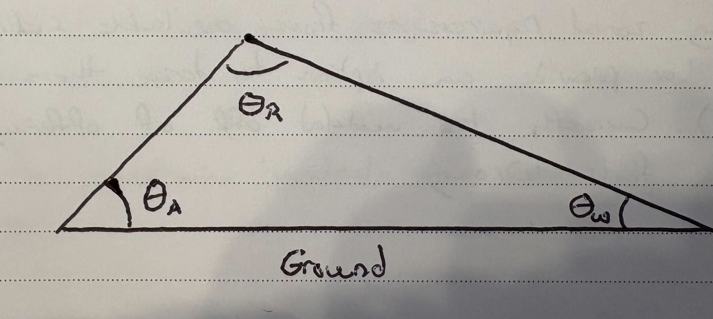
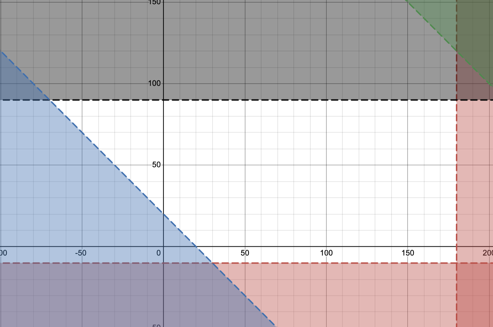
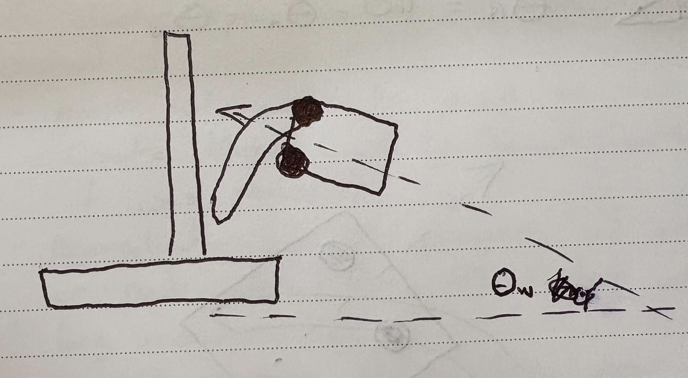
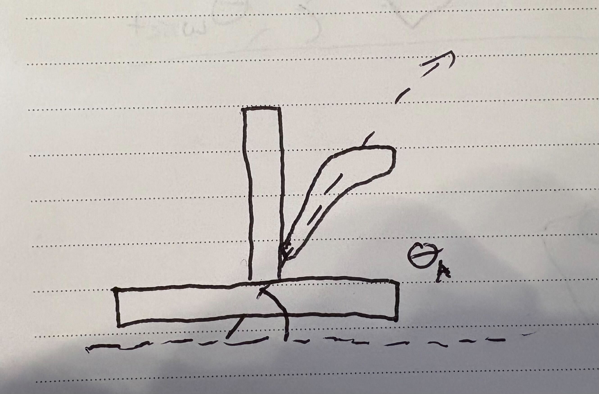

# Coralator Tuning

The coralator essentially has three degrees of freedom.
Those are height (from the elevator), arm angle, and wrist angle.
Not all of these can be adjusted independently - certain configurations can result in the robot colliding with itself.
We can model the various valid configurations to create what's called a configuration space.
To move our end effector from one position to another, we must ensure that we stay within the confines of the configuration space.

To define this configuration space, we must consider the bounds of each mechanism.
We'll start with the individual components - the arm and the wrist.
Let's say the arm has a lower limit of -10 degrees and an upper limit of 90 degrees, while the wrist can rotate a full 360 degrees.
The arm is constrained by the drivetran and the elevator, while the wrist isn't constrained.
However, the wrist does have a constraint, but it's dependent on the arms position.
We can use the following diagram to determine the relative angle bettween the arm and the wrist:

Doing some trig, we find that the wrist's relative angle to the arm can be found with the following equation:

$$
\theta_r = 180-\theta_a-\theta_w
$$

Let's say this angle, $\theta_r$, is constrained to the bound \[-120,160\] degrees.
If we graph all of these constraints, this is the result:

In this graph, the x-axis represents the wrist angle while the y-axis represents the arm angle.
The white space represents all possible valid configurations.
When performing path planning for the coralator, we must ensure that it's path never drifts outside of this configuration space.

For more details on condiguration spaces and motion planning, check out chapter 16 of [Controls Engineering in FRC](https://file.tavsys.net/control/controls-engineering-in-frc.pdf).

## Appendix

**Wrist Angle Diagram:**

**Arm Angle Diagram:**

